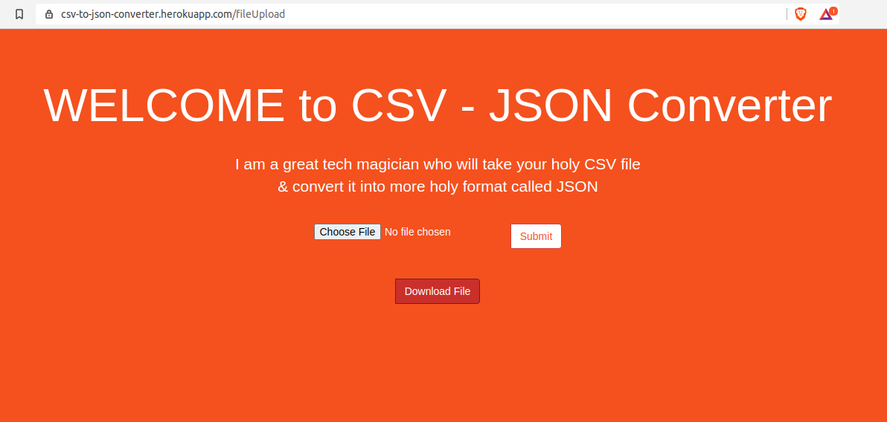

# CSV to JSON Converter
This is CSV to JSON file converter. In simple terms, it takes CSV files from the user and converts it into JSON format.

## Table of Contents
1. [Pre-requisite](#pre-requisite)
1. [Implementation](#implementation)
1. [Screenshots](#screenshots)
1. [EXTRAS: How to setup Heroku and Travis CI](#extras:-how-to-setup-heroku-and-travis-ci)
1. [Tech Used](#tech-used)


## Pre-requisite
- Node.js
- npm

## Implementation
- Clone the repository
- Install dependencies 
```
npm install
```
- Run the server
```
node server.js
```
- Open a browser and browse 'localhost:3000'

## Screenshots




## EXTRAS: How to setup Heroku and Travis CI
- Create an account on Travis and connect it to your Github when prompted. 

Travis will ask which projects to add to the Travis workflow. Add the project which you want to deploy. 

To see if you linked the repo successfully, go to that repository's settings in GitHub and open the 'Integrations' tab. You can see Travis is added there. 

- Install Travis CLI using following commands
```
sudo apt install ruby ruby-dev
sudo gem install travis
```
- Create an account on Heroku
- Click 'Create new App' for your project.
- Go to the 'Deploy' tab and click the Github logo. Link GitHub repository of your project
- Enable Automatic Deployment and tick 'wait for CI to pass before deploy' since you will be using Travis CI for testing your application before pushing it to production.
- Install Heroku CLI using the following command
```
sudo snap install --classic heroku
```
- Login Heroku through a terminal
```
heroku login
```
- Create a remote reference to your repo
```
heroku git:remote -a app_name_given_in_heroku
```
- Create a .travis.yml file. Copy the contents of my Travis file into yours. You have to make the travis-Heroku key to be inserted in this file. 
- To create Travis api_key and automatically add it into your Travis file
```
travis encrypt $(heroku auth:token) --add deploy.api_key
```
- The last step is to edit your code and push it to GitHub master.

CONGRATS!! Your CI(Travis) and CD(Heroku) is working and you can check the logs on their website's respective dashboards. 

## Tech Used
- Node.js (language)
- Express.js (server library)
- Vanilla HTML,CSS
- Travis CI (Continuous Integration)
- Heroku (Continuous Deployment)